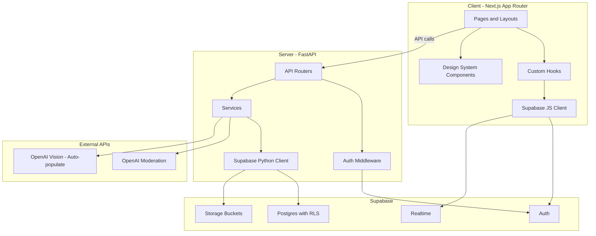
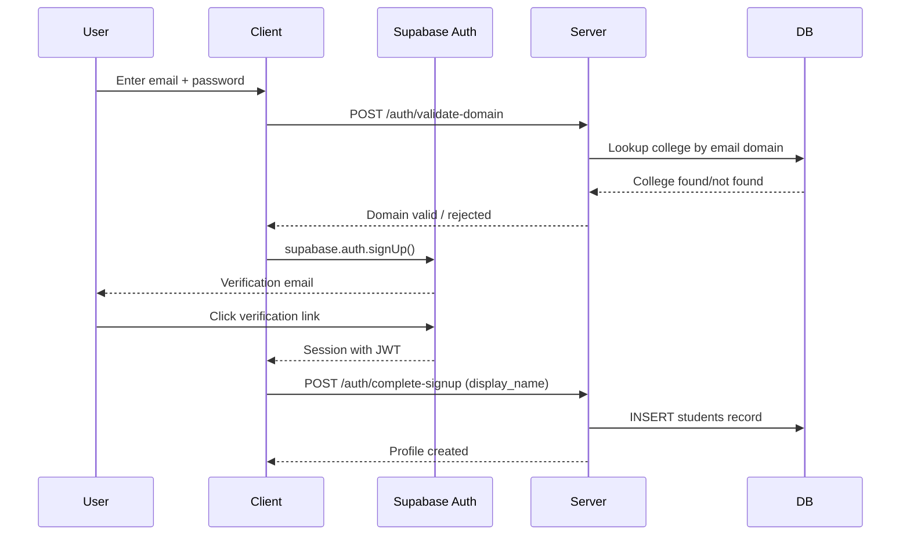
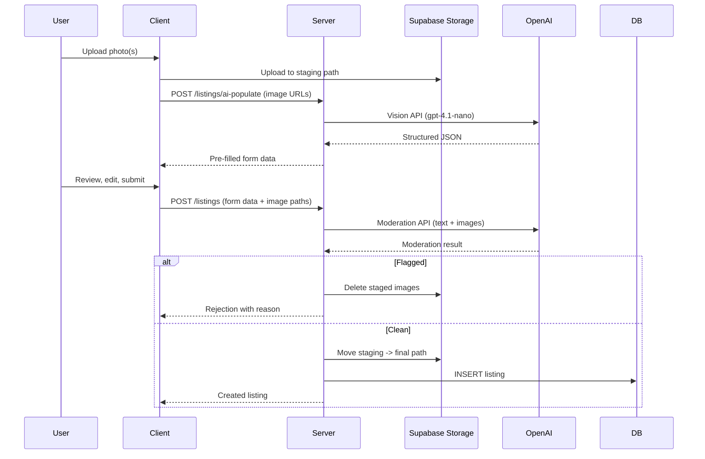

# DormDrop Implementation Plan

## Architecture Overview




## Monorepo Structure

```
DormDrop/
├── client/                    # Next.js 15, App Router, TypeScript, Tailwind v4
│   ├── app/
│   │   ├── (auth)/            # Login, signup routes
│   │   ├── (main)/            # Authenticated app shell
│   │   │   ├── browse/        # Marketplace grid + search
│   │   │   ├── listing/[id]/  # Listing detail
│   │   │   ├── sell/          # Create listing flow
│   │   │   ├── messages/      # Conversation list + chat
│   │   │   ├── profile/[id]/  # Public profile
│   │   │   ├── settings/      # Edit own profile
│   │   │   └── saved/         # Saved listings
│   │   ├── globals.css
│   │   ├── layout.tsx
│   │   └── page.tsx           # Landing / redirect
│   ├── components/
│   │   ├── ui/                # Design system primitives
│   │   ├── listings/          # Listing-specific components
│   │   ├── messages/          # Messaging components
│   │   └── layout/            # Nav, shell, footer
│   ├── lib/
│   │   ├── supabase/          # Client + server Supabase helpers
│   │   ├── api.ts             # Server API client
│   │   └── utils.ts
│   ├── hooks/                 # useAuth, useListings, useMessages, etc.
│   └── types/                 # Generated + manual TS types
├── server/
│   ├── app/
│   │   ├── main.py            # FastAPI app + CORS
│   │   ├── config.py          # Settings via pydantic-settings
│   │   ├── dependencies.py    # Supabase client, current user injection
│   │   ├── routers/
│   │   │   ├── auth.py        # POST signup validation, profile creation
│   │   │   ├── listings.py    # CRUD, search, extend, mark-sold
│   │   │   ├── conversations.py
│   │   │   ├── students.py    # Profile read/update
│   │   │   ├── reports.py
│   │   │   └── saved.py
│   │   ├── services/
│   │   │   ├── moderation.py  # OpenAI moderation wrapper
│   │   │   ├── ai_populate.py # Vision model auto-fill
│   │   │   └── storage.py     # Staging -> final path moves
│   │   └── middleware/
│   │       └── auth.py        # JWT validation dependency
│   └── pyproject.toml
├── shared/
│   ├── constants.json         # Single source of truth for enums
│   ├── generate_ts.py         # JSON -> TypeScript codegen
│   └── generate_py.py         # JSON -> Python codegen
├── supabase/
│   └── migrations/
│       └── 20260406000000_initial_schema.sql
└── README.md
```

---

## Phase 0 -- Project Scaffolding

Set up the monorepo, install dependencies, and configure tooling so both `client/` and `server/` can run locally.

**Client (`client/`)**

- `npx create-next-app@latest` with App Router, TypeScript, Tailwind CSS v4, ESLint
- Add dependencies: `@supabase/supabase-js`, `@supabase/ssr`, `lucide-react`, `zustand`, `react-hook-form`, `zod`
- Configure `next.config.ts` with Supabase image domains
- Create `.env.local` template with `NEXT_PUBLIC_SUPABASE_URL`, `NEXT_PUBLIC_SUPABASE_PUBLIC_KEY`, `NEXT_PUBLIC_API_URL`

**Server (`server/`)**

- Initialize with `uv init` and `pyproject.toml`
- Dependencies: `fastapi`, `uvicorn`, `supabase`, `openai`, `pydantic-settings`, `python-multipart`, `httpx`, `pyjwt[crypto]`
- Create `.env` template with `SUPABASE_URL`, `SUPABASE_SECRET_KEY`, `SUPABASE_JWT_SECRET`, `OPENAI_API_KEY`

**Shared (`shared/`)**

- `constants.json` defining categories, conditions, listing statuses, conversation statuses, report target types
- Codegen scripts that produce `client/types/constants.ts` and `server/app/constants.py` from that JSON

---

## Phase 1 -- Supabase Database and Storage

Write a single migration file that stands up the entire schema from the design doc.

**Migration file** (`supabase/migrations/20260406000000_initial_schema.sql`):

- `updated_at` trigger function
- Tables: `colleges`, `students`, `listings`, `conversations`, `messages`, `reports`, `saved_listings` with all constraints, FKs, check constraints on enums
- Indexes on: `listings(college_id)`, `listings(seller_id)`, `listings(status)`, `listings(category)`, `listings(expires_at)`, `conversations(listing_id)`, `conversations(buyer_id)`, `messages(conversation_id)`
- Full-text search: add `search_vector tsvector` column on `listings`, GIN index, trigger to auto-update from `title || description`
- RLS policies scoped by `college_id` on all tenant-sensitive tables
- Storage buckets: `profile_pictures`, `listing_photos`, `college_assets` with size/type policies
- Seed: insert Gonzaga University row (`zagmail.gonzaga.edu`)
- The supabase project ID is yxiwlsvmddqoxqyxahag, apply the migrations using the supabase MCP tool

---

## Phase 2 -- Authentication




**Server endpoints:**

- `POST /auth/validate-domain` -- check email domain against `colleges.email_domain` before signup
- `POST /auth/complete-signup` -- called after first verified login to create `students` row linked to `auth.users.id`
- Auth middleware dependency that extracts the Supabase JWT from `Authorization` header, verifies its signature using `SUPABASE_JWT_SECRET` (via `PyJWT`), and injects `current_user` (user_id + college_id) into all protected routes

**Client:**

- Supabase client setup with `@supabase/ssr` for server-side cookie-based sessions
- Auth context/hook (`useAuth`) exposing `user`, `session`, `signUp`, `signIn`, `signOut`
- Protected route middleware in `middleware.ts` redirecting unauthenticated users to `/login`

---

## Phase 3 -- Design System and UI Primitives

This phase builds the component library following every rule in `.cursor/rules.mdc`. No feature pages yet -- just the atoms and molecules.

**Brand identity decisions:**

- **Font**: A distinctive display font loaded via `next/font/google` (e.g., "DM Sans" for body, "Space Grotesk" for headings -- will finalize a non-generic pairing at build time avoiding Inter/Roboto/Arial). Warm, humanist feel.
- **Accent color**: Warm amber/copper tone -- `#C8754A` range. Earthy, not blue.
- **Primary CTA**: Near-black warm dark -- `stone-900` equivalent.
- **Surfaces**: Off-white warm neutrals (`stone-50`, `stone-100`). No pure white.
- **Text**: `stone-900` primary, `stone-500` secondary. Clear distinction.
- **Icon library**: `lucide-react` exclusively.

**Components to build:**

- `Button` -- 4 tiers (primary, ghost, outlined, destructive), loading spinner, disabled state, no bold text, no rounded corners
- `Input` -- consistent height, custom focus ring (accent), label-above pattern, no rounded corners
- `Textarea` -- same treatment as Input
- `Select` / `Dropdown` -- fully custom, scale+opacity enter animation, no native `<select>`
- `Modal` -- `createPortal`, overlay click-to-close, header/body/footer structure, `max-h-[90vh]`, no rounded corners
- `Badge` / `Pill` -- rounded corners allowed here (status indicators)
- `Card` -- sharp corners, image-forward, subtle hover lift, price prominent
- `Skeleton` -- warm shimmer loader
- `Spinner` -- small border-based CSS animation
- `Avatar` -- rounded (allowed), fallback initials
- `Toast` -- custom notification system, no `alert()`

**Layout components:**

- `AppShell` -- nav + content area
- `Navbar` -- logo, search bar, nav links, user menu
- `MobileNav` -- bottom tab bar for mobile
- `ListingGrid` -- responsive 1/2/3-4 column grid

`**globals.css`:**

- CSS custom properties for the full color palette
- `::selection` tinted with brand accent
- Font imports
- Base reset overrides

---

## Phase 4 -- Listings (Core Feature)

The primary feature of the app. Split into browse, detail, and creation.

### 4a -- Browse / Marketplace

- **Page**: `(main)/browse/page.tsx`
- Full-text search bar calling Postgres `tsquery`
- Filter sidebar/drawer: category (multi-select checkboxes), condition, price range slider, status (active default)
- Sort: newest, price asc, price desc
- `ListingGrid` rendering `ListingCard` components
- Infinite scroll or paginated load (cursor-based pagination from server)
- All queries scoped to user's `college_id` via RLS

**Server**: `GET /listings` with query params for search, filters, sort, pagination.

### 4b -- Listing Detail

- **Page**: `(main)/listing/[id]/page.tsx`
- Image carousel (swipeable on mobile)
- Title, price (formatted from cents), condition badge, category badge
- Description, seller info (avatar, name, link to profile)
- "Message Seller" button (opens/creates conversation)
- "Save" toggle (heart icon)
- If own listing: edit, mark sold, extend, remove actions

**Server**: `GET /listings/{id}`, `PATCH /listings/{id}` (status changes, extend), `DELETE /listings/{id}` (soft remove)

### 4c -- Create Listing




- **Page**: `(main)/sell/page.tsx`
- Multi-step form: (1) Upload photos, (2) AI auto-fills + user edits, (3) Review and submit
- Photo upload with drag-and-drop, reorder, max 8 images, preview thumbnails
- AI auto-populate via `POST /listings/ai-populate` sending image URLs to server
- Server calls `gpt-4.1-nano` (or cheapest multimodal model available), validates category against enum
- Pre-fills form; user reviews all fields before submission
- On submit: server runs OpenAI moderation, then persists or rejects
- Store raw AI output in `ai_generated`, moderation payload in `moderation_result`

**Server endpoints:**

- `POST /listings/ai-populate` -- vision model call, returns suggested fields
- `POST /listings` -- validate, moderate, persist
- `POST /listings/{id}/extend` -- reset `expires_at` to now + 30d

---

## Phase 5 -- Messaging

**Real-time chat** using Supabase Realtime subscriptions.

- **Page**: `(main)/messages/page.tsx` -- conversation list (left panel) + active chat (right panel / full screen on mobile)
- Conversation list: sorted by latest message, unread count badge, listing thumbnail + title + other party name
- Chat view: message bubbles, timestamp, auto-scroll, input bar at bottom
- "Message Seller" from listing detail creates conversation via `POST /conversations` if `(listing_id, buyer_id)` doesn't exist, otherwise opens existing
- Supabase Realtime: subscribe to `INSERT` on `messages` filtered by `conversation_id`
- Mark messages as read when conversation is opened (`PATCH /messages/read`)
- Seller's Venmo handle visible in conversation header if set

**Server endpoints:**

- `POST /conversations` -- create or return existing
- `GET /conversations` -- list user's conversations with latest message preview
- `GET /conversations/{id}/messages` -- paginated message history
- `POST /conversations/{id}/messages` -- send message (inserts into `messages`)
- `PATCH /messages/read` -- bulk mark as read

---

## Phase 6 -- Profiles and Settings

- **Public profile** `(main)/profile/[id]/page.tsx`: avatar, display name, bio, Venmo handle, active listings grid
- **Settings** `(main)/settings/page.tsx`: edit display name, bio, Venmo handle, upload/change profile picture
- **My listings**: tab or section showing own listings with status management (mark sold, extend, remove)

**Server endpoints:**

- `GET /students/{id}` -- public profile data
- `PATCH /students/me` -- update own profile
- `POST /students/me/avatar` -- upload profile picture

---

## Phase 7 -- Saved Listings and Reports

**Saved listings:**

- Heart/bookmark toggle on `ListingCard` and listing detail
- `(main)/saved/page.tsx` showing saved listings grid
- `POST /saved/{listing_id}`, `DELETE /saved/{listing_id}`

**Reports:**

- Report modal accessible from listing detail, profile, and conversation views
- Select target type + reason text
- `POST /reports` -- creates report row, status `pending`
- Reviewed manually via Supabase dashboard (no admin panel per spec)

---

## Phase 8 -- Listing Expiry Cron

- A scheduled task (Railway cron or `pg_cron` in Supabase) that runs daily
- Query: `UPDATE listings SET status = 'expired', updated_at = now() WHERE expires_at < now() AND status = 'active'`
- If using Railway cron: a lightweight FastAPI endpoint `POST /internal/expire-listings` called by the cron job, protected by an internal secret

---

## Phase 9 -- Polish and Deployment

- Responsive audit: test all pages at mobile / tablet / desktop breakpoints
- Loading states: skeleton loaders on every data-fetching page
- Error boundaries and fallback UI
- Empty states (no listings, no messages, no saved items)
- `README.md` with setup instructions, env var docs, and development workflow
- Railway deployment:
  - `client/`: build command `npm run build`, start command `npm start`
  - `server/`: start command `uvicorn app.main:app --host 0.0.0.0 --port 8000`
  - `Make a local dev script to start frontend and backend.`
  - Environment variables configured per service
- Supabase project: run migration, verify RLS, configure auth settings (disable OAuth, enable email verification)

