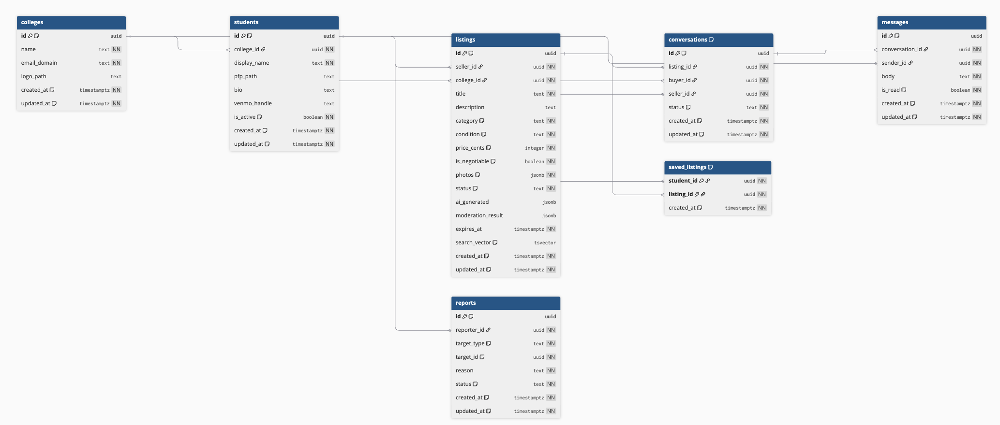

# DormDrop — Systems Analysis & Design Document

---

## 1. System Description

DormDrop is a peer-to-peer student marketplace that enables college students to buy and sell used goods within their campus community. Students register using a verified school email address (currently gated to Gonzaga University's `zagmail.gonzaga.edu` domain, with a multi-school architecture ready for expansion). Once registered, a student can create listings with photos, title, description, category, condition, and price. Other students at the same college can browse, search, and filter listings, save items for later, and message sellers directly through an in-app chat system. The platform uses OpenAI for two safety features: vision-based auto-population of listing details from photos, and content moderation that screens both text and images before a listing goes live. Listings expire after 30 days and can be extended, marked as sold, or removed by their owner. Users can also report listings, students, or messages for policy violations. The system is scoped per-college — students can only see listings and profiles from their own school.

---

## 2. Entity List with Attributes

### colleges

| Column | Type | Constraints |
|--------|------|-------------|
| id | uuid | PRIMARY KEY, DEFAULT `gen_random_uuid()` |
| name | text | NOT NULL |
| email_domain | text | NOT NULL, UNIQUE |
| logo_path | text | nullable |
| created_at | timestamptz | NOT NULL, DEFAULT `now()` |
| updated_at | timestamptz | NOT NULL, DEFAULT `now()`, auto-updated by trigger |

### students

| Column | Type | Constraints |
|--------|------|-------------|
| id | uuid | PRIMARY KEY, FOREIGN KEY → `auth.users(id)` ON DELETE CASCADE |
| college_id | uuid | NOT NULL, FOREIGN KEY → `colleges(id)` |
| display_name | text | NOT NULL |
| pfp_path | text | nullable |
| bio | text | nullable |
| venmo_handle | text | nullable |
| is_active | boolean | NOT NULL, DEFAULT `true` |
| created_at | timestamptz | NOT NULL, DEFAULT `now()` |
| updated_at | timestamptz | NOT NULL, DEFAULT `now()`, auto-updated by trigger |

### listings

| Column | Type | Constraints |
|--------|------|-------------|
| id | uuid | PRIMARY KEY, DEFAULT `gen_random_uuid()` |
| seller_id | uuid | NOT NULL, FOREIGN KEY → `students(id)` ON DELETE CASCADE |
| college_id | uuid | NOT NULL, FOREIGN KEY → `colleges(id)` |
| title | text | NOT NULL |
| description | text | nullable |
| category | text | NOT NULL, CHECK (must be one of 20 defined categories — see below) |
| condition | text | NOT NULL, CHECK (`new`, `like_new`, `good`, `fair`, `poor`) |
| price_cents | integer | NOT NULL, CHECK (`price_cents >= 0`) |
| is_negotiable | boolean | NOT NULL, DEFAULT `false` |
| photos | jsonb | NOT NULL, DEFAULT `'[]'` — array of `{order, path}` objects |
| status | text | NOT NULL, DEFAULT `'active'`, CHECK (`active`, `sold`, `reserved`, `expired`, `removed`) |
| ai_generated | jsonb | nullable — stores AI auto-populate suggestions |
| moderation_result | jsonb | nullable — stores moderation scan output |
| expires_at | timestamptz | NOT NULL, DEFAULT `now() + 30 days` |
| search_vector | tsvector | nullable, auto-maintained by trigger from `title` (weight A) and `description` (weight B) |
| created_at | timestamptz | NOT NULL, DEFAULT `now()` |
| updated_at | timestamptz | NOT NULL, DEFAULT `now()`, auto-updated by trigger |

**Category CHECK values:** `furniture`, `textbooks`, `electronics`, `appliances`, `kitchenware`, `bedding_linens`, `lighting`, `storage_organization`, `desk_accessories`, `clothing`, `shoes`, `sports_equipment`, `bikes_scooters`, `musical_instruments`, `school_supplies`, `dorm_decor`, `mini_fridge`, `tv_monitor`, `gaming`, `free`

### conversations

| Column | Type | Constraints |
|--------|------|-------------|
| id | uuid | PRIMARY KEY, DEFAULT `gen_random_uuid()` |
| listing_id | uuid | NOT NULL, FOREIGN KEY → `listings(id)` ON DELETE CASCADE |
| buyer_id | uuid | NOT NULL, FOREIGN KEY → `students(id)` ON DELETE CASCADE |
| seller_id | uuid | NOT NULL, FOREIGN KEY → `students(id)` ON DELETE CASCADE |
| status | text | NOT NULL, DEFAULT `'open'`, CHECK (`open`, `closed`) |
| created_at | timestamptz | NOT NULL, DEFAULT `now()` |
| updated_at | timestamptz | NOT NULL, DEFAULT `now()`, auto-updated by trigger |
| | | UNIQUE (`listing_id`, `buyer_id`) |

### messages

| Column | Type | Constraints |
|--------|------|-------------|
| id | uuid | PRIMARY KEY, DEFAULT `gen_random_uuid()` |
| conversation_id | uuid | NOT NULL, FOREIGN KEY → `conversations(id)` ON DELETE CASCADE |
| sender_id | uuid | NOT NULL, FOREIGN KEY → `students(id)` ON DELETE CASCADE |
| body | text | NOT NULL |
| is_read | boolean | NOT NULL, DEFAULT `false` |
| created_at | timestamptz | NOT NULL, DEFAULT `now()` |
| updated_at | timestamptz | NOT NULL, DEFAULT `now()`, auto-updated by trigger |

### saved_listings (junction table)

| Column | Type | Constraints |
|--------|------|-------------|
| student_id | uuid | NOT NULL, FOREIGN KEY → `students(id)` ON DELETE CASCADE |
| listing_id | uuid | NOT NULL, FOREIGN KEY → `listings(id)` ON DELETE CASCADE |
| created_at | timestamptz | NOT NULL, DEFAULT `now()` |
| | | PRIMARY KEY (`student_id`, `listing_id`) |

### reports

| Column | Type | Constraints |
|--------|------|-------------|
| id | uuid | PRIMARY KEY, DEFAULT `gen_random_uuid()` |
| reporter_id | uuid | NOT NULL, FOREIGN KEY → `students(id)` ON DELETE CASCADE |
| target_type | text | NOT NULL, CHECK (`listing`, `student`, `message`) |
| target_id | uuid | NOT NULL (logical FK — no database-enforced foreign key, since it references multiple tables) |
| reason | text | NOT NULL |
| status | text | NOT NULL, DEFAULT `'pending'` |
| created_at | timestamptz | NOT NULL, DEFAULT `now()` |
| updated_at | timestamptz | NOT NULL, DEFAULT `now()`, auto-updated by trigger |

### Indexes

| Index | Table | Column(s) / Type |
|-------|-------|------------------|
| idx_listings_college_id | listings | `college_id` |
| idx_listings_seller_id | listings | `seller_id` |
| idx_listings_status | listings | `status` |
| idx_listings_category | listings | `category` |
| idx_listings_expires_at | listings | `expires_at` |
| idx_listings_search_vector | listings | `search_vector` (GIN) |
| idx_conversations_listing_id | conversations | `listing_id` |
| idx_conversations_buyer_id | conversations | `buyer_id` |
| idx_messages_conversation_id | messages | `conversation_id` |

### Storage Buckets (Supabase Storage)

| Bucket | Public | Purpose |
|--------|--------|---------|
| profile_pictures | No | Student avatar images, namespaced by `{user_id}/` |
| listing_photos | No | Listing photo uploads, namespaced by `{user_id}/` |
| college_assets | Yes | College logos |

---

## 3. Relationships

### One-to-One

- **auth.users → students**: Each Supabase Auth user maps to exactly one student profile. The `students.id` column is both the primary key and a foreign key to `auth.users(id)`.

### One-to-Many

- **colleges → students**: One college has many students. Each student belongs to exactly one college via `students.college_id`.
- **colleges → listings**: One college has many listings. Each listing belongs to one college via `listings.college_id`. This denormalization enables efficient per-college queries without joining through students.
- **students → listings**: One student (as seller) has many listings via `listings.seller_id`.
- **listings → conversations**: One listing has many conversations (one per interested buyer) via `conversations.listing_id`.
- **conversations → messages**: One conversation has many messages via `messages.conversation_id`.
- **students → messages**: One student sends many messages via `messages.sender_id`.
- **students → reports**: One student files many reports via `reports.reporter_id`.
- **students → conversations (as buyer)**: One student has many conversations where they are the buyer via `conversations.buyer_id`.
- **students → conversations (as seller)**: One student has many conversations where they are the seller via `conversations.seller_id`.

### Many-to-Many

- **students ↔ listings** (via `saved_listings`): Students can save many listings, and each listing can be saved by many students. The `saved_listings` junction table has a composite primary key of (`student_id`, `listing_id`).

### Polymorphic Reference

- **reports → (listings | students | messages)**: The `reports` table uses a `target_type` discriminator (`listing`, `student`, or `message`) and a `target_id` UUID that logically references the target row. This is not enforced by a database foreign key since it points to different tables depending on `target_type`.

---

## 4. Page-by-Page Plan

### Authentication Pages

**Sign Up** (`/signup`) — Three-step registration wizard:
1. **Email step**: Student enters their school email. On blur or submit, the app calls the API to validate the email domain against the `colleges` table. If the domain is not recognized, an error is shown.
2. **Details step**: Displays the confirmed email (read-only). Student enters a display name, password, and password confirmation. On submit, the account is created via Supabase Auth and the display name is saved to localStorage for post-verification profile creation.
3. **Verify step**: Shows a confirmation message telling the student to check their email for a verification link, with a button to navigate to login.

**Login** (`/login`) — Email and password form. On successful authentication, the app checks if a student profile exists. If not, it calls the complete-signup endpoint to create one using the display name from localStorage (or falls back to the email prefix).

**Forgot Password** (`/forgot-password`) — Email input form. Submits a password reset request through Supabase Auth, which sends an email with a reset link that redirects to `/reset-password`.

**Reset Password** (`/reset-password`) — New password and confirmation form. Exchanges the reset code from the email link for a session and updates the user's password.

### Main Application Pages

**Browse** (`/browse`) — The primary marketplace view. Displays a grid of active listings scoped to the logged-in student's college. Features:
- **Search**: Full-text search via the navbar search bar. Uses Postgres `tsvector` with English config, weighting title (A) over description (B). Search term is passed as a URL query parameter.
- **Category filter**: Multi-select checkbox dropdown built from the shared constants list (20 categories). Selecting categories filters listings to those matching any selected category.
- **Condition filter**: Single-select dropdown with an "Any" option plus the 5 condition values.
- **Price range filter**: Min and max USD input fields with 500ms debounce. Values are converted to cents for the API query.
- **Sort**: Dropdown with three options — Newest (default, `created_at` descending), Price: Low → High (`price_cents` ascending), Price: High → Low (`price_cents` descending).
- **Clear all button**: Appears when any filter is active, resets all filters and sort to defaults.
- **Listing grid**: Responsive grid (1–4 columns based on viewport). Each card shows the cover photo, price, title, condition badge, and a heart icon to save/unsave.
- **Pagination**: Cursor-based. A "Load more" button appears when a full page (20 items) is returned, fetching the next batch using the last item's `created_at` as the cursor.
- **Save/unsave**: Clicking the heart icon toggles the saved state with optimistic UI — the heart fills immediately and reverts on API error.

**Sell** (`/sell`) — Three-step listing creation wizard:
1. **Photos step**: Drag-and-drop or click-to-browse upload zone. Accepts image files only (JPG, PNG, WebP). Up to 8 photos. Each photo is uploaded to Supabase Storage and then sent to the image moderation endpoint — if flagged, the photo is removed with a toast error. Photos can be reordered by drag-and-drop; the first photo is labeled "Cover." Each photo has a remove button. The "Next" button is disabled until at least one photo is fully uploaded.
2. **Details step**: Form fields for title, description, category (dropdown from constants), condition (dropdown from constants), price (USD, converted to cents on submit), and a negotiable checkbox. On entering this step, the API's AI auto-populate endpoint is called with the first photo — if successful, the form fields are pre-filled with AI-suggested values. Fields are editable regardless of AI state. A loading indicator shows while AI is analyzing. Client-side validation runs on submit (see Validation Rules). On successful creation, advances to step 3. If text/image moderation fails, the error is shown inline and the user stays on step 2.
3. **Done step**: Success state shows a checkmark, "Listed!" message, and buttons to "View listing" or "Sell another." Error state shows the failure message and a "Go back & fix" button.

**Listing Detail** (`/listing/[id]`) — Full detail view of a single listing. Layout is a two-column grid on desktop (image gallery left, details right) and stacked on mobile.
- **Image gallery**: Desktop shows a main image with thumbnail strip below. Mobile shows a horizontally scrollable carousel with snap points. Clicking a thumbnail updates the main image.
- **Details panel**: Title, price, condition badge, category badge, description, and "Listed X ago" timestamp.
- **Seller block**: Avatar, display name (links to seller's public profile), and Venmo handle (links to Venmo profile) if set.
- **Buyer actions** (shown when viewing someone else's listing): "Message Seller" button (creates a conversation or navigates to an existing one), save/unsave heart button, "Report listing" link that opens a modal.
- **Owner actions** (shown when viewing your own listing): "Mark as Sold" (sets status to sold), "Extend" (resets expiry to 30 days from now and re-activates), "Remove" (soft-deletes by setting status to removed, then redirects to browse).
- **Status badge**: Shown overlaid on the image when status is not `active` (Sold, Reserved, Expired, Removed).
- **Report modal**: Text area for the reason. Submit is disabled until the reason is non-empty. Submits to the reports API with `target_type: "listing"`.

**Messages** (`/messages`) — Split-panel messaging interface.
- **Left panel (conversation list)**: Shows all open conversations ordered by `updated_at` descending. Each row displays the listing thumbnail, the other participant's name, the listing title, last message preview, and time since last message. Clicking a conversation activates it in the right panel. On mobile, the list and chat are shown one at a time with a back arrow to return to the list.
- **Right panel (active chat)**: Header shows the other user's avatar, name, listing title, and Venmo handle if available. Message thread loads from the API (newest first, reversed for display). Messages from the current user are right-aligned with a brand-subtle background; messages from the other user are left-aligned with a sunken background. Timestamps appear between messages when there is a gap of more than 5 minutes. A text input and send button at the bottom. Send is disabled when the input is empty or whitespace-only. Messages are sent with optimistic UI — the message appears immediately and is replaced with the server response, or removed on error. Supabase Realtime subscribes to new inserts on the `messages` table for the active conversation, displaying incoming messages in real time. On opening a conversation, all unread messages from the other participant are marked as read.
- **Deep linking**: The page accepts a `?conversation=<id>` URL parameter to auto-open a specific conversation.

**Saved** (`/saved`) — Grid of all listings the student has saved. Each card shows the listing photo, price, title, and condition. Clicking the heart icon unsaves the item (with optimistic removal from the grid).

**Profile** (`/profile/[id]`) — Public profile view of another student. Shows their avatar, display name, bio, Venmo handle, and member-since date. Below, displays a grid of their active listings.

**Settings** (`/settings`) — The logged-in student's account management page.
- **Avatar upload**: Click the avatar to select a new image. The file is uploaded via multipart form POST to the server, which stores it in the `profile_pictures` bucket and updates the `students.pfp_path` column. Max file size is 5MB. Must be an image MIME type.
- **Profile fields**: Display name, bio (textarea), Venmo handle (prefixed with `@`). "Save Changes" button with loading state and a "Saved" confirmation indicator.
- **My Listings**: Table of all the student's own listings showing thumbnail, title, price, and status badge. Active listings have "Sold", "Extend", and "Remove" action buttons.
- **Sign Out**: Destructive-styled button that signs out via Supabase Auth and redirects to `/login`.

---

## 5. Validation Rules

### Sign Up Form

| Field | Rule |
|-------|------|
| Email | Required. Must be a valid email (HTML5 `type="email"`). Domain must match an `email_domain` in the `colleges` table (validated server-side via `POST /auth/validate-domain`). |
| Display name | Required (HTML5 `required`). |
| Password | Required. Minimum 8 characters. |
| Confirm password | Required. Must exactly match the password field. |

### Login Form

| Field | Rule |
|-------|------|
| Email | Required. |
| Password | Required. |

### Reset Password Form

| Field | Rule |
|-------|------|
| New password | Required. Minimum 8 characters. |
| Confirm password | Required. Must match. |

### Create Listing Form (Sell Page — Step 2)

| Field | Client-Side Rule | Server-Side Rule |
|-------|-----------------|-----------------|
| Photos | At least 1 photo uploaded and finished processing before advancing to step 2. | 1–8 photos required. Each photo is moderated via OpenAI — flagged images are rejected with a description of the violation. |
| Title | Required (non-empty after trim). | Required (NOT NULL). Combined with description, moderated via OpenAI text moderation — flagged text is rejected. |
| Description | Required (non-empty after trim). | Nullable in DB, but moderated along with title. |
| Category | Required (must select a value). | Must be one of the 20 defined category values (CHECK constraint). |
| Condition | Required (must select a value). | Must be one of `new`, `like_new`, `good`, `fair`, `poor` (CHECK constraint). |
| Price | Required. Must be a valid number. Must be ≥ 0. | `price_cents` must be an integer ≥ 0 (CHECK constraint). |
| Negotiable | Boolean toggle, defaults to false. | No additional validation. |

### Update Listing (PATCH)

| Field | Server-Side Rule |
|-------|-----------------|
| category | If provided, must be one of the 20 defined categories. |
| condition | If provided, must be one of the 5 defined conditions. |
| status | If provided, must be one of `active`, `sold`, `reserved`, `expired`, `removed`. |

### Profile / Settings Form

| Field | Rule |
|-------|------|
| Display name | At least one field must be provided in the update payload (server rejects empty updates). |
| Bio | Optional. Free text. |
| Venmo handle | Optional. Free text. |
| Avatar file | Must have `image/*` MIME type. Maximum 5MB file size. Both validated server-side. |

### Message Form

| Field | Rule |
|-------|------|
| Message body | Non-empty after trim (client-side: send button disabled while empty/whitespace. Server-side: `body` is NOT NULL in DB). |

### Report Form

| Field | Client-Side Rule | Server-Side Rule |
|-------|-----------------|-----------------|
| Reason | Submit button disabled until reason is non-empty after trim. | Must be non-empty after trim. `target_type` must be one of `listing`, `student`, `message`. |

### Conversation Creation

| Rule | Enforcement |
|------|-------------|
| Cannot message yourself | Server rejects if `listing.seller_id == current_user.id`. |
| Listing must be at your college | Server rejects if `listing.college_id != current_user.college_id`. |
| One conversation per buyer per listing | UNIQUE constraint on (`listing_id`, `buyer_id`). If a conversation already exists, it is returned instead of creating a duplicate. |

### General Security Rules

| Rule | Detail |
|------|--------|
| Authentication required | All API endpoints except `POST /auth/validate-domain` require a valid JWT. JWT is ES256-signed by Supabase. |
| College scoping | Listings queries are scoped to the student's `college_id`. Listing detail rejects access if `college_id` doesn't match. RLS policies enforce this at the database level. |
| Ownership enforcement | Update and delete operations on listings verify `seller_id == current_user.id`. Profile updates verify `id == auth.uid()`. RLS policies provide a second layer of enforcement. |
| Row Level Security | Enabled on all tables. Students can only read profiles from their own college. Listings are read-scoped to the student's college. Conversations and messages are scoped to participants. Saved listings and reports are scoped to the owner. |
| No SQL injection | All queries use the Supabase client library's parameterized query builder — no raw SQL string concatenation. |
| Secrets management | Supabase URL, secret key, and OpenAI API key are loaded from environment variables via Pydantic settings, never committed to the repo. |

---

## 6. Entity-Relationship Diagram



```
┌──────────────────┐       ┌──────────────────┐
│   auth.users     │       │    colleges       │
│──────────────────│       │──────────────────│
│ id (PK)          │       │ id (PK)          │
└────────┬─────────┘       │ name             │
         │ 1:1             │ email_domain (UQ)│
         ▼                 │ logo_path        │
┌──────────────────┐       │ created_at       │
│    students      │       │ updated_at       │
│──────────────────│       └────────┬─────────┘
│ id (PK/FK)       │───────────────►│ 1:N
│ college_id (FK)  │               │
│ display_name     │               │
│ pfp_path         │               │
│ bio              │               │
│ venmo_handle     │               │
│ is_active        │               │
│ created_at       │               │
│ updated_at       │               │
└──┬───┬───┬───┬───┘               │
   │   │   │   │                   │
   │   │   │   │  ┌────────────────┼──────────────┐
   │   │   │   │  │                │              │
   │   │   │   ▼  ▼                ▼              │
   │   │   │  ┌──────────────────┐               │
   │   │   │  │    listings      │               │
   │   │   │  │──────────────────│               │
   │   │   │  │ id (PK)          │               │
   │   │   │  │ seller_id (FK)   │◄──────────────┘
   │   │   │  │ college_id (FK)  │         1:N
   │   │   │  │ title            │
   │   │   │  │ description      │
   │   │   │  │ category         │
   │   │   │  │ condition        │
   │   │   │  │ price_cents      │
   │   │   │  │ is_negotiable    │
   │   │   │  │ photos (jsonb)   │
   │   │   │  │ status           │
   │   │   │  │ expires_at       │
   │   │   │  │ search_vector    │
   │   │   │  │ created_at       │
   │   │   │  │ updated_at       │
   │   │   │  └──┬───────────┬───┘
   │   │   │     │           │
   │   │   │     │ 1:N       │
   │   │   │     ▼           │
   │   │   │  ┌──────────────┴───┐
   │   │   │  │  conversations   │
   │   │   │  │──────────────────│
   │   │   │  │ id (PK)          │
   │   │   │  │ listing_id (FK)  │
   │   │   │  │ buyer_id (FK)    │◄── students (1:N)
   │   │   │  │ seller_id (FK)   │◄── students (1:N)
   │   │   │  │ status           │
   │   │   │  │ created_at       │
   │   │   │  │ updated_at       │
   │   │   │  │ UQ(listing,buyer)│
   │   │   │  └──────┬───────────┘
   │   │   │         │ 1:N
   │   │   │         ▼
   │   │   │  ┌──────────────────┐
   │   │   │  │    messages      │
   │   │   │  │──────────────────│
   │   │   │  │ id (PK)          │
   │   │   │  │ conversation_id  │
   │   │   │  │ sender_id (FK)   │◄── students (1:N)
   │   │   │  │ body             │
   │   │   │  │ is_read          │
   │   │   │  │ created_at       │
   │   │   │  │ updated_at       │
   │   │   │  └──────────────────┘
   │   │   │
   │   │   │  ┌──────────────────┐
   │   │   └─►│  saved_listings  │◄── M:N junction
   │   │      │──────────────────│
   │   │      │ student_id (PK/FK)│
   │   │      │ listing_id (PK/FK)│
   │   │      │ created_at       │
   │   │      └──────────────────┘
   │   │
   │   │      ┌──────────────────┐
   │   └─────►│    reports       │
   │          │──────────────────│
   │          │ id (PK)          │
   │          │ reporter_id (FK) │
   │          │ target_type      │──► listing | student | message
   │          │ target_id        │
   │          │ reason           │
   │          │ status           │
   │          │ created_at       │
   │          │ updated_at       │
   │          └──────────────────┘
   │
   └── (connections shown above)
```
